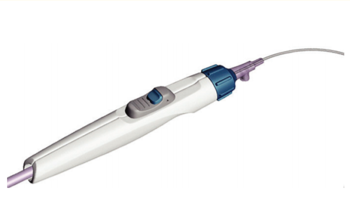
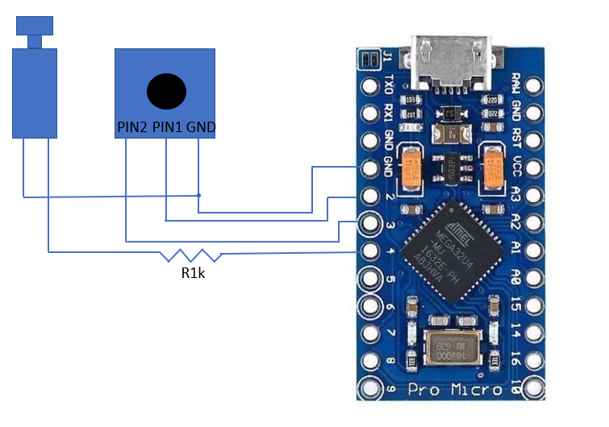

# Leitura do catéter de reentrada - MVP
Projeto para fazer a leitra de forma digital de um catéter de reentrada, ilustrado na imagem a seguir. 

# Hardware 
* [Arduino pro micro](https://store.arduino.cc/usa/arduino-nano)
* [Encoder rotacioal EC11](https://www.eletrodex.com.br/potenciometro-encoder-sem-fim-ec11-5-terminais.html)
* [Push button](https://www.eletrodex.com.br/push-button-padr-o-ds323-na.html)

## Ligações 

O encoder e o botão serão ligados no esquema de pull down, tendo o pino de referência conectado ao GND e o arduino fazendo a função de pull up, como na imagem a seguir:

# Softwares 
* [Vscode](https://code.visualstudio.com/)
* [PlatformIO](https://platformio.org/)

# Output

O código entrega para a porta USB Serial um Json a cada 0.1 segundos no seguinte formato: 

~~~javascript
{
    "button status" : 0,
    "encoder counter" : 234
}
~~~

* Butotn Status - Esado do botão (0 ou 1)
* Encoder count - Contagem absoluta de paços sendo os valores positivos, sentido horário, negativos sentido anti horário. O encoder possui 12 passos por revolução. 

# Versões

## V0.1.0 - 08/07/2020
Funcionalidades: 

    Ler encoder
    Ler botão
    Enviar Json via Serial

